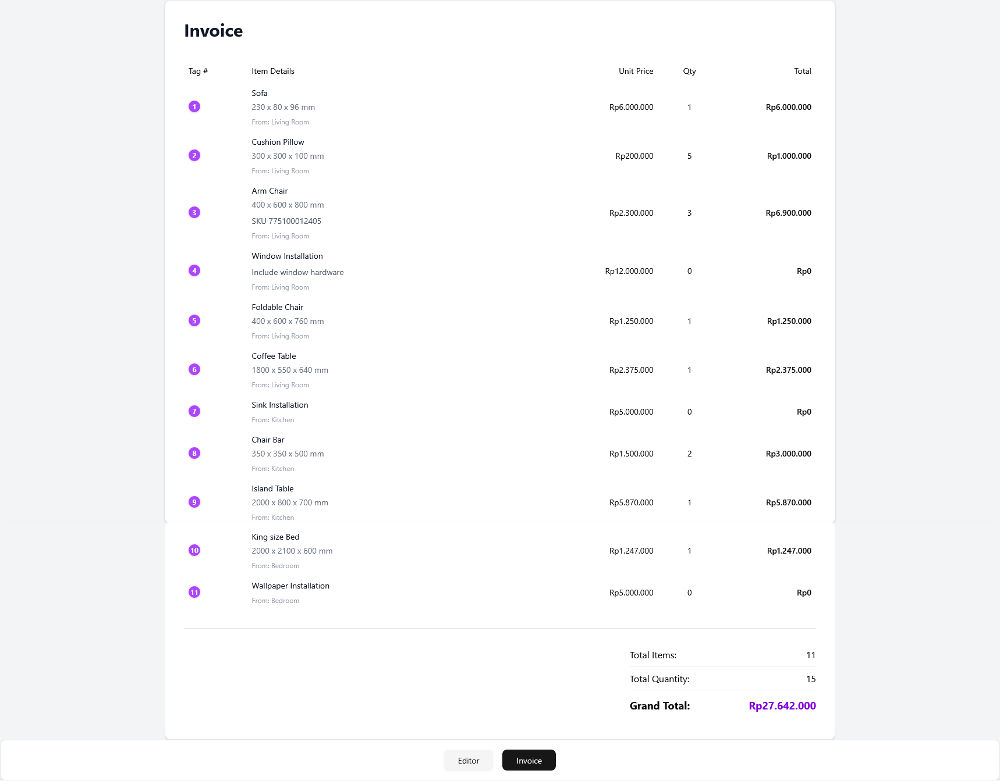
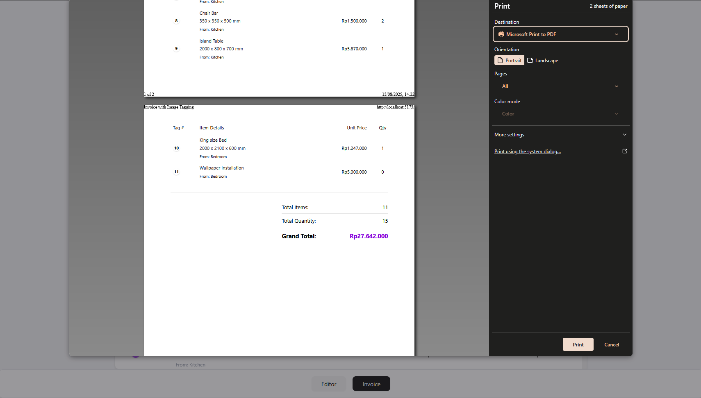

### Image Tagging Playground

A playground to try Vite, shadcn/tailwind, and react-dnd. An invoice builder dashboard with image tagging to show location of item in invoice. 


### Features
- Upload images (no backend, file uploaded as blob)

    
- Adding tag on image to show location of item in invoice. Using percentage x/y to prevent position change on different screen size

    
- Dragable thumbnail (with react-dnd) with tag number update. Tag inside image is also draggable

    
- Support print mode to get clean invoice without unnecessary component like footer 

    
    


### Getting started
1) Install dependencies

```bash
yarn
```

2) Run the dev server

```bash
yarn dev
```

3) Build for production

```bash
yarn build
```

4) Preview production build

```bash
yarn preview
```


### How it works
- Images
  - Stored as blob/object URLs for simplicity (no uploads to a server)
  - Old blob URLs are revoked on replace/delete to avoid memory leaks

- Thumbnails
  - Reordered via drag handle; persistent order in memory via `order`

- Tags and items
  - Click the image to add a tag (x/y in %), which opens the add-item dialog
  - Tag numbers reindex when image order changes

- Invoice

  - Print CSS avoids row splits and repeats the header per page

### Project structure
- `src/components/` UI components (thumbnails, dialogs, invoice, image with tags)
- `src/hooks/` stateful logic (`useImages`, `useTags`, `useItems`)
- `src/types/` shared TypeScript types (`image.ts`, `tag.ts`)
- `src/constants.ts` shared constants (e.g., max upload size)
- `src/index.css` Tailwind and print styles

### Notes
- In-memory only. Refreshing clears images/tags/items.
- Blob URLs reference local files; nothing is uploaded.
